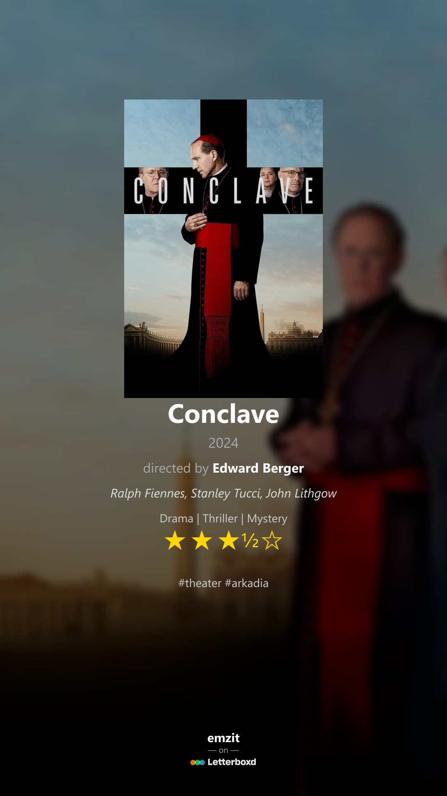

# 🎬 Letterboxd Poster Generator

Creates a stylized 9:16 poster for a Letterboxd film review — perfect for sharing on social media.

<p align="center">
  
</p>


## ✨ Features

- Extracts metadata from Letterboxd and TMDb:
  - Title, Year, Director, Music, Genre, Rating, Actors, Tags
- Beautifully styled for vertical mobile-friendly export
- Customizable:
  - Metadata order (via drag-and-drop)
  - Visual style: backdrop blur, brightness, poster scale
  - Optional gradient overlay and footer scaling
- Mobile + desktop responsive UI
- Supports JPEG download or clipboard copy

---

## 🚀 Live Demo

> Coming soon via [Render](https://render.com/) deployment

---

## 🖥️ Local Setup

### 1. Clone the repository

```bash
git clone https://github.com/emmanuelmavely/letterboxd-poster.git
cd letterboxd-poster
```

### 2. Install dependencies

```bash
npm install
```

### 3. Add TMDb API Key

Create a `.env` file in the root directory:

```env
TMDB_API_KEY=your_tmdb_api_key_here
```

Get one from https://www.themoviedb.org/settings/api

---

### 4. Run the server

```bash
node server.js
```

Then visit [http://localhost:3000](http://localhost:3000)

---

## 🌐 Deployment (Render)

To deploy full-stack:

1. Push this repo to GitHub
2. Go to [render.com](https://render.com)
3. New → Web Service → Connect GitHub Repo
4. Configure:
   - **Start command**: `node server.js`
   - **Root directory**: `/`
   - **Environment**: Node
   - **Add env var**: `TMDB_API_KEY=your_key`
5. Deploy and you're live 🎉

---

## 📝 License

MIT — feel free to use and modify.

---

## 🙌 Credits

- Letterboxd metadata: [letterboxd.com](https://letterboxd.com)
- Movie info: [TMDb API](https://developers.themoviedb.org/)
- UI/UX: Custom drag & slider controls

---

> Built with ❤️ by Emmanuel Mavely
